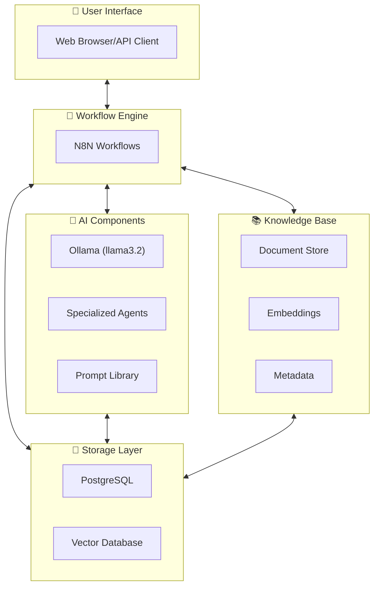

# AI | Self-Hosted Agentic System Project

> 🎯 **Building an intelligent personal assistant ecosystem** that transforms how you interact with your knowledge, tasks, and projects through specialized AI agents.

## 🌟 Project Vision

Create a comprehensive **self-hosted AI agent system** that serves as your digital cognitive extension:

1. **Personal Knowledge Base** - Consume, maintain, and intelligently access notes, documentation, projects, and tasks
2. **Specialized Agent Team** - Coordinated AI agents working together:
   - **Project Manager Agent** - Requirements analyzer for feature sketches
   - **Code Analyst Agent** - Change analyzer for reviewing diffs and recent changes  
   - **Refiner Agent** - Synthesizes feedback and coordinates improvements
3. **Context-Aware Intelligence** - Switch seamlessly between different life domains (work, personal, learning)

## 🏗️ System Architecture Overview



## 🚀 Implementation Roadmap

```mermaid
gantt
    title AI Agent System Implementation
    dateFormat X
    axisFormat %s
    
    section Phase 1: Foundation
    Knowledge Base Setup    :done, phase1, 0, 3w
    Vector Storage Config   :done, 1w
    Document Ingestion      :done, 2w
    
    section Phase 2: Core Agents
    Requirements Analyzer   :active, phase2, 3w, 2w
    Agent Prompt Engineering:2w
    N8N Workflow Setup     :2w
    
    section Phase 3: Analysis
    Change Analyzer Agent  :phase3, after phase2, 2w
    Git Integration        :2w
    Impact Analysis        :1w
    
    section Phase 4: Integration
    Refiner Agent         :phase4, after phase3, 3w
    Multi-Agent Coordination:2w
    End-to-End Testing    :1w
    
    section Phase 5: Enhancement
    Performance Optimization:phase5, after phase4, 4w
    Additional Agents     :ongoing
    UI Improvements       :2w
```

## 🤖 AI Initiatives & Agent Ecosystem

### Core Agents

| Agent | Purpose | Status | Key Capabilities |
|-------|---------|--------|-----------------|
| **Requirements Analyzer** | Transform feature sketches into structured requirements | 🚧 In Progress | Natural language → structured specs, gap identification, acceptance criteria |
| **Change Analyzer** | Analyze code/content changes for impact | 📋 Planned | Git diff analysis, impact assessment, technical summaries |
| **Refiner Agent** | Coordinate and synthesize agent outputs | 📋 Planned | Multi-agent coordination, feedback synthesis, workflow orchestration |
| **Project Manager** | Agile project management and planning | 📋 Planned | Backlog management, sprint planning, issue tracking |
| **JARVIS Assistant** | Personal productivity orchestrator | 🎯 Vision | Calendar management, task prioritization, context switching |

### Specialized Modules

- **📝 Note Taking System** - Second brain methodology for idea capture and organization
- **🔄 ETL Processes** - Document ingestion and transformation pipelines
- **🔗 Integrations** - Notion, GitHub, Git repository management
- **🎯 Context Engineering** - AI context optimization and prompt building
- **🎵 Audio Transcription** - Voice-to-text processing capabilities

## 📁 Project Structure

```
📂 AI/
├── 📂 agents/              # Agent specifications and prompts
│   ├── requirements-analyzer-agent.md
│   ├── Software Project Manager & Developer.md
│   └── JARVIS Personal Assistant - Product Overview.md
├── 📂 architecture/        # System design and components
│   ├── system-overview.md
│   └── architecture.md
├── 📂 environment/         # Development environment setup
│   ├── AI.code-workspace
│   └── laboratory-tools-and-feedback.md
├── 📂 modules/             # Core system modules
│   ├── context-engineering/
│   ├── knowledge-base/
│   └── audio transcription/
├── 📂 _templates/          # Reusable templates
├── 📂 _prompt_builder/     # Prompt engineering tools
└── implementation-roadmap.md
```

## 🛠️ Technology Stack

| Component | Technology | Purpose |
|-----------|------------|----------|
| **Workflow Engine** | N8N | Orchestration and automation |
| **LLM** | Ollama (llama3.2) | Local language model inference |
| **Embeddings** | nomic-embed-text | Vector generation for semantic search |
| **Vector DB** | Qdrant | Semantic search and retrieval |
| **Database** | PostgreSQL | Structured data storage |
| **UI Options** | Open WebUI, Flowise, LobeChat | User interfaces |
| **Deployment** | Docker Compose | Containerized deployment |

## 🎯 Current Focus

### Phase 2: Requirements Analyzer Agent (In Progress)

**Goals:**
- ✅ Knowledge base foundation established
- 🚧 Building first specialized agent for requirement analysis
- 🚧 Implementing N8N workflows for agent orchestration
- 📋 Designing structured input/output formats

**Next Steps:**
1. Complete Requirements Analyzer agent implementation
2. Build comprehensive testing framework
3. Document agent interaction patterns
4. Begin Change Analyzer agent development

## 🚀 Getting Started

1. **📖 Understand the Vision** - Review [JARVIS Personal Assistant - Product Overview](agents/JARVIS%20Personal%20Assistant%20-%20Product%20Overview.md)
2. **🏗️ Explore Architecture** - Study [system-overview.md](architecture/system-overview.md)
3. **📋 Follow Roadmap** - Track progress in [implementation-roadmap.md](implementation-roadmap.md)
4. **⚙️ Setup Environment** - Configure development workspace
5. **🤖 Build First Agent** - Start with Requirements Analyzer

## 📚 Key Resources

- **[Note Taking System](Note%20Taking%20System.md)** - Personal knowledge capture methodology
- **[Implementation Roadmap](implementation-roadmap.md)** - Detailed development phases
- **[System Architecture](architecture/system-overview.md)** - Technical system design
- **[Agent Specifications](agents/)** - Individual agent documentation

## 🎪 Vision: The Complete System

Imagine having a team of AI agents that:
- **📝 Captures** your ideas and notes seamlessly
- **🔍 Analyzes** your requirements and transforms sketches into actionable specs
- **⚡ Monitors** your code changes and provides intelligent insights
- **🎯 Coordinates** between different contexts (work, personal, learning)
- **🚀 Accelerates** your productivity while reducing cognitive load

*This is more than just an AI assistant - it's your cognitive extension, working 24/7 to amplify your capabilities.*

---

## 📄 Documentation Guidelines

This documentation serves both human and AI agent consumption:

1. **📝 Templates** - Follow established patterns in each directory
2. **🔍 Clarity** - Use structured, machine-readable language
3. **🔄 Updates** - Maintain cross-references when implementing features
4. **📊 Tracking** - Update roadmap progress regularly

> 💡 **Tip**: Each agent directory contains detailed specifications, prompt engineering examples, and implementation guides.
