# Project Dependency Graph & Roadmap

This document contains the dependency graph for the AI Agent System project, showing the relationships between all issues and their development phases.

## Overall Project Dependencies

```mermaid
graph TD
    %% Phase 1: Knowledge Base Foundation - NOT STARTED
    Phase1[Phase 1: Knowledge Base Foundation]
    
    %% Phase 2: Requirements Analyzer Agent (35 total issues)
    Phase2[Phase 2: Requirements Analyzer Agent]
    Issue3[#3: 2.1 Input Schema Definition - M-5]
    Issue4[#4: 2.2 Validation Workflow in n8n - L-8]
    Issue5[#5: 2.3 Storage Mechanism in Postgres - L-8]
    Issue6[#6: 2.4 Prompt Engineering – Core Instructions - M-6]
    Issue7[#7: 2.5 Few-shot Examples Library - S-3]
    Issue8[#8: 2.6 Output JSON Schema & Validation - S-4]
    Issue9[#9: 2.7 n8n Workflow Orchestration - XL-13]
    Issue10[#10: 2.8 Feedback Loop Design - L-10]
    Issue11[#11: 2.9 Unit & E2E Tests - L-9]
    Issue1[#1: Phase 2 Epic - Requirements Analyzer Agent]

    %% Phase 3: Change Analyzer Agent
    Phase3[Phase 3: Change Analyzer Agent]
    Issue12[#12: 3.1 Git Diff Extraction Utility - M-6]
    Issue13[#13: 3.2 Manual Change Description Parser - L-7]
    Issue14[#14: 3.3 Metadata Extraction Module - L-8]
    Issue15[#15: 3.4 Change Classification Prompt - M-6]
    Issue16[#16: 3.5 Context Retrieval from KB - S-4]
    Issue17[#17: 3.6 Impact Analysis Logic - XL-13]
    Issue18[#18: 3.7 Summary & Recommendation Generator - L-8]
    Issue19[#19: 3.8 Integration Tests - L-9]
    Issue20[#20: Phase 3 Epic - Change Analyzer Agent]

    %% Phase 4: Refiner & Multi-Agent Integration
    Phase4[Phase 4: Refiner & Multi-Agent Integration]
    Issue21[#21: 4.1 Agent-to-Agent Message Schema - M-6]
    Issue22[#22: 4.2 Conversation History Store - L-9]
    Issue23[#23: 4.3 Routing Logic in n8n - XL-13]
    Issue24[#24: 4.4 Refiner Prompt & Context Assembly - L-10]
    Issue25[#25: 4.5 Synthesis Workflow Implementation - XL-15]
    Issue26[#26: 4.6 UI Endpoint for Multi-Agent Session - L-11]
    Issue27[#27: 4.7 Monitoring & Logging Stack - L-12]
    Issue28[#28: 4.8 End-to-End Integration Tests - XL-16]
    Issue29[#29: Phase 4 Epic - Refiner & Multi-Agent Integration]

    %% Phase 5: Advanced AI & Optimization
    Phase5[Phase 5: Advanced AI & Optimization]
    Issue30[#30: 5.1 Caching Layer for Vector Retrieval - M-5]
    Issue31[#31: 5.2 Vector Search Parameter Tuning - L-13]
    Issue32[#32: 5.3 Adaptive Chunking Research - L-13]
    Issue33[#33: 5.4 Agent Design Template Framework - M-5]
    Issue34[#34: 5.5 Data Source Connector Skeletons - L-13]
    Issue35[#35: 5.6 Scheduled Agent Operations via N8N - M-5]

    %% Infrastructure & Cross-cutting
    Issue2[#2: Gap Analysis - Implementation Roadmap vs Repository State]

    %% Phase Dependencies
    Phase1 --> Phase2
    Phase2 --> Phase3
    Phase3 --> Phase4
    Phase4 --> Phase5

    %% Phase 2 Dependencies
    Issue3 --> Issue4
    Issue3 --> Issue5
    Issue6 --> Issue7
    Issue6 --> Issue8
    Issue4 --> Issue9
    Issue6 --> Issue9
    Issue8 --> Issue9
    Issue9 --> Issue10
    Issue10 --> Issue11
    Issue1 -.-> Phase2

    %% Phase 3 Dependencies
    Issue12 --> Issue15
    Issue13 --> Issue15
    Issue14 --> Issue15
    Issue15 --> Issue16
    Issue12 --> Issue17
    Issue14 --> Issue17
    Issue15 --> Issue17
    Issue16 --> Issue17
    Issue17 --> Issue18
    Issue18 --> Issue19
    Issue20 -.-> Phase3

    %% Phase 4 Dependencies (Foundation -> Core -> UI/Ops -> Testing)
    Issue21 --> Issue22
    Issue21 --> Issue23
    Issue22 --> Issue23
    Issue23 --> Issue24
    Issue24 --> Issue25
    Issue22 --> Issue26
    Issue25 --> Issue26
    Issue23 --> Issue27
    Issue26 --> Issue28
    Issue27 --> Issue28
    Issue25 --> Issue28
    Issue29 -.-> Phase4

    %% Phase 5 Dependencies (Performance -> Intelligence -> Framework -> Automation)
    Issue30 --> Issue31
    Issue31 --> Issue32
    Issue32 --> Issue33
    Issue33 --> Issue34
    Issue34 --> Issue35

    %% Cross-phase Dependencies
    Phase1 --> Issue16
    Phase1 --> Issue30
    Issue2 -.-> Phase1
    
    %% Styling
    classDef phase fill:#e1f5fe
    classDef epic fill:#f3e5f5
    classDef highPriority fill:#ffebee
    classDef mediumPriority fill:#fff3e0
    classDef lowPriority fill:#e8f5e8
    classDef infrastructure fill:#fce4ec

    class Phase1,Phase2,Phase3,Phase4,Phase5 phase
    class Issue1,Issue20,Issue29 epic
    class Issue3,Issue4,Issue5,Issue6,Issue8,Issue9,Issue12,Issue15,Issue17,Issue18,Issue21,Issue22,Issue23,Issue24,Issue25 highPriority
    class Issue7,Issue10,Issue11,Issue13,Issue14,Issue16,Issue19,Issue26,Issue27,Issue31,Issue32,Issue34 mediumPriority
    class Issue28,Issue30,Issue33,Issue35 lowPriority
    class Issue2 infrastructure
```

## Effort Distribution by Phase

| Phase | Total Issues | Total Effort Points | Estimated Weeks |
|-------|-------------|-------------------|-----------------|
| Phase 1 | Not tracked in issues | TBD | TBD |
| Phase 2 | 9 issues | 67 points | 13-17 weeks |
| Phase 3 | 8 issues | 61 points | 12-15 weeks |
| Phase 4 | 8 issues | 102 points | 20-25 weeks |
| Phase 5 | 6 issues | 54+ points | 10-13 weeks |
| **Total** | **31+ issues** | **284+ points** | **55-70+ weeks** |

## Critical Path Analysis

### Immediate Blockers
1. **Phase 1 Foundation** - Must be completed before any agent development
2. **#3: Input Schema Definition** - Blocks multiple Phase 2 tasks
3. **#21: Agent Message Schema** - Foundation for multi-agent system

### High-Risk Dependencies
1. **#9: n8n Workflow Orchestration (XL-13)** - Complex integration point
2. **#17: Impact Analysis Logic (XL-13)** - Core analytical capability
3. **#25: Synthesis Workflow Implementation (XL-15)** - Most complex single task
4. **#28: End-to-End Integration Tests (XL-16)** - Final validation step

### Parallel Development Opportunities
- **Phase 2**: #6 (Prompt Engineering) can be developed in parallel with #3-#5
- **Phase 3**: #12, #13, #14 (foundational utilities) can be developed in parallel
- **Phase 4**: #21, #22 (foundation components) can be developed in parallel
- **Phase 5**: Most optimization tasks can be developed in parallel

## Development Recommendations

### Short-term Focus (Next 4-8 weeks)
1. Complete Phase 1 foundation work (not tracked in current issues)
2. Begin Phase 2 with #3 (Input Schema Definition)
3. Start parallel work on #6 (Prompt Engineering)

### Medium-term Planning (2-4 months)
1. Complete Phase 2 Requirements Analyzer
2. Begin Phase 3 Change Analyzer foundational work
3. Prepare Phase 4 architecture planning

### Long-term Strategy (6+ months)
1. Complete multi-agent integration (Phase 4)
2. Begin optimization and advanced features (Phase 5)
3. Continuous testing and refinement

## Risk Mitigation

### Technical Risks
- **N8N Complexity**: Plan for extended development time on workflow tasks
- **Multi-Agent Coordination**: Invest heavily in message schema and testing
- **Performance Requirements**: Start optimization early in Phase 5

### Dependency Risks
- **Phase 1 Delays**: Could cascade through entire project timeline
- **External Dependencies**: Monitor Ollama, Qdrant, and N8N compatibility
- **Resource Constraints**: Consider breaking down XL tasks into smaller chunks

---

*This dependency graph is automatically generated and should be updated as issues are created, modified, or completed.*
